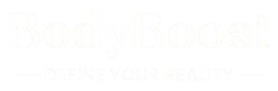

<br />
<div align="center">
  <a href="https://github.com/othneildrew/Best-README-Template">
    
  </a>

  <h1 align="center">BodyBoost</h1>

  <p align="center">
    Fuel your body, elevate your mind, and boost your life!
    <br />
    <a href="https://github.com/othneildrew/Best-README-Template"><strong>Explore the docs »</strong></a>
    <br />
    <br />
    <a href="https://github.com/othneildrew/Best-README-Template">Key Features</a>
    ·
    <a href="https://github.com/othneildrew/Best-README-Template/issues/new?labels=bug&template=bug-report---.md">Setup and Installation</a>
    ·
    <a href="https://github.com/othneildrew/Best-README-Template/issues/new?labels=enhancement&template=feature-request---.md">Credits</a>
    </p>
</div>

<!-- ABOUT THE PROJECT -->
## About BodyBoost

[](Login/static/loginPage/images/screenshot20240828at100419pmremovebgpreview11333-r5i-200h.png)

In this day and age, there are a lot of individuals out there who have decided to make a change and improve their lives through exercise and diet! Unfortunately, this process does not come easily and may be quite discouraging for newbies without the proper guide. BodyBoost is here to make sure that you get the proper nutrition and push to help you achieve the best version of yourself. Whether you're inexperienced or someone that can bench 200 kgs! BodyBoost is here to get you all set!

Here's why:
* Get real-time updates on your calories burned and earned
* Personalized exercise suggestions that would adapt to your preferred body goal
* Different types of intensities that would be recorded every day

Let's Get Started!

Signup to BodyBoost today and embark on a journey towards a healthier, stronger, and more confident you.

<br>

## Built With

<p align="center">
  <a href="https://badge.fury.io/for/py/django?icon=t">
    
  </a>
  <a>
    
  </a>
  <a>
    
  </a>
  <a>
    
  </a>
  <a>
    
  </a>

<br><br>

## Key Features

### 1.	User Registration and Authentication
-	The system should allow users to register with an email, social media, or phone number and securely authenticate their identity during login.

### 2.	User Profile Management
-	Users should be able to create and edit profiles, including personal details such as age, gender, weight, height, and fitness goals.

### 3.	Workout Plans and Food/Calories Suggestions
-	The app should provide personalized workout plans based on user goals and preferences (e.g., strength training, cardio, flexibility). Additionally, the system should suggest daily calorie intake and meal plans based on the user's fitness goals (e.g., weight loss, muscle gain) and personal data such as age, weight, height, and activity level.

### 4.	Activity Tracking
-	The app should track various activities such as workouts, steps, calories burned and gained, distance traveled, and other fitness metrics.

### 5.	Diet and Nutrition Logging
-	Users should be able to log their meals, water intake, and nutritional information to monitor their diet in conjunction with their fitness goals.

### 6.	Progress Monitoring and Reports
-	The system should generate reports and visualizations of user progress over time, such as weight loss, muscle gain, and workout frequency.

### 7.	Exercise Library with Instructions
-	The app should include a library of exercises with detailed instructions, videos, and variations for users to follow during their workouts.

### 8.	Push Notifications and Reminders
-	The system should send notifications to remind users of their workout schedules, meal times, or motivational messages based on their preferences.

<br>

## Setup and Installation

To clone and run this application, you'll need [Git](https://git-scm.com) and [Python](https://www.python.org/) installed on your computer. From your command line:

```bash
# Clone this repository
$ git clone https://github.com/kurt-navaja/BodyBoost_IM2

# Navigate to the project directory
$ cd BodyBoost

# Run the Django development server:
$ python manage.py runserver
```
<br>

## Gannt Chart

https://docs.google.com/spreadsheets/d/1f90Yp8g11Nwr4a8dJtN1Ycbtg82Tj78b9GX91rSNIt0/edit?usp=sharing

<br>

## Credits

This software uses the following:

- [django](https://www.djangoproject.com/)
- [javascript](https://www.javascript.com/)

<br>

## Contributors

<table>
  <tr>
    <td align="center">
      <a href="https://github.com/kurt-navaja">
        <br />
        <sub><b>Kurt Bryan Navaja</b></sub>
      </a>
    </td>
    <td align="center">
      <a href="https://github.com/kimasaph">
        <br />
        <sub><b>Kim Asaph Bacaltos</b></sub>
      </a>
    </td>
  </tr>
</table>


<!-- LICENSE -->
## License

Distributed under the Unlicense License. See `LICENSE.txt` for more information.


<!-- CONTACT -->
## Contact

Kim Asaph Bacaltos - https://www.facebook.com/asaph.87
Kurt Bryan Navaja - https://www.facebook.com/kurt.navaja123
